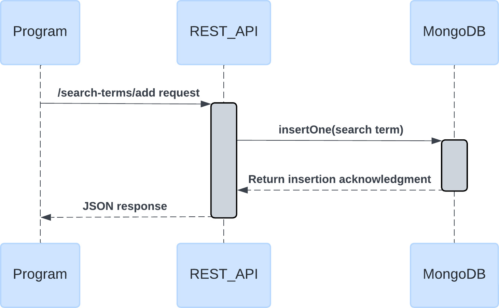
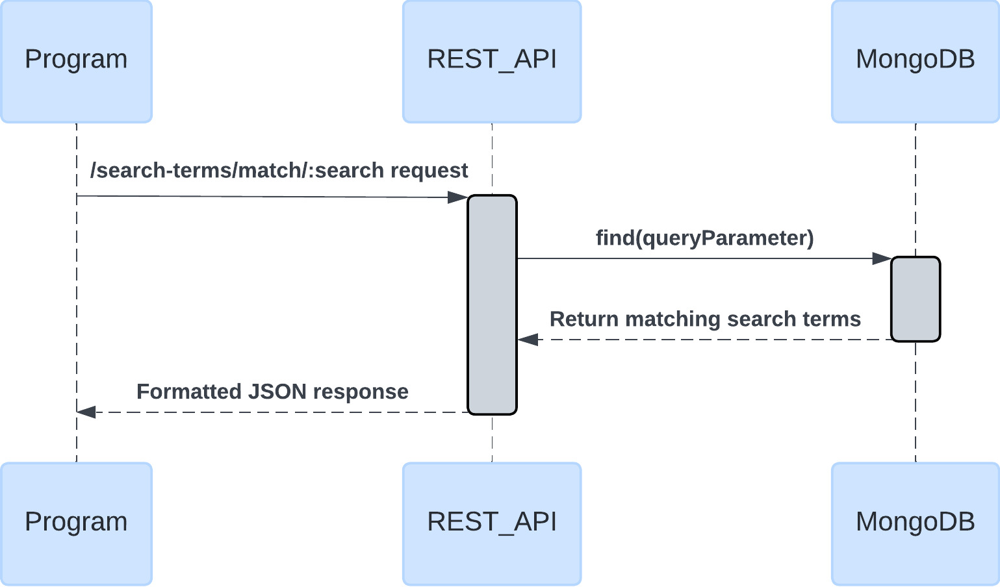
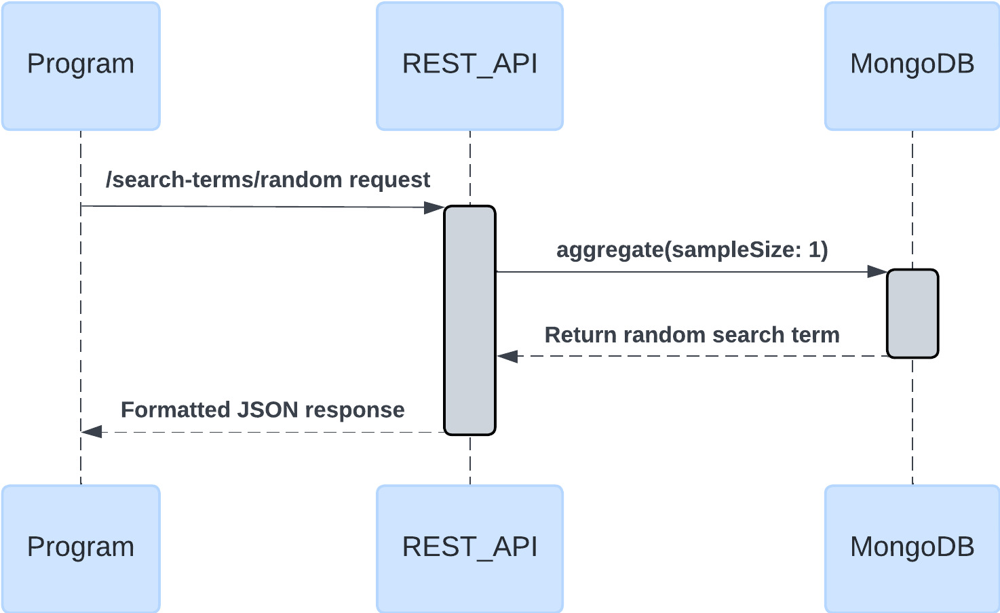

# Search Microservice

Store and retrieve a shared collection of search terms the users of your application have entered. For use in future auto-completion, search analysis, etc.

## Installation and Setup

After cloning, install the necessary dependecies by running `npm install` in the project directory. Before utilizing the endpoints, create a .env file and enter the port for the service to run on as `PORT` and the MongoDB connect string as `MONGO_URI`. The database should be called search-terms-db, with a collection named search-terms. To start up the server/application, run `npm start` in the project directory.

## Making Requests and Receiving Data

There are 4 different endpoints to use in this application, /search-terms/add, /search-terms/all, /search-terms/match/:search, and /search-terms/random. The service is not deployed, so the calls are meant to be made via localhost at the port you chose in your env file. In the main application, you may utilize another name for the port in a different env file, or simply hard code the port you chose. In this case, we will just represent the port as PORT in a template literal.

### Add a Search Term

The endpoint /search-terms/add can be used to add a new search term to the database. We can use fetch or axios to make the post request, and place the search term as "search" in the request body. The response includes JSON with an acknowledgement of the addition of the search term and the id of the added search term in the database. These code snippets should be used in an async function.

#### Fetch

```javascript
// Make the request to the endpoint
const response = await fetch(`http://localhost:${PORT}/search-terms/add`, {
  method: "POST",
  headers: {
    "Content-Type": "application/json",
  },
  body: { search: "search term to add" },
});

// Parse the JSON to receive the data
const response = await response.json();
```

#### Axios

```javascript
// Make the request to the endpoint
const response = await axios.post(
  `http://localhost:${PORT}/search-terms/add`,
  {
    search: "search term to add",
  },
  {
    headers: { "Content-Type": "application/json" },
  }
);

// Access response.data for the data
const data = response.data;
```

#### Response Format

```json
{
  "acknowledged": true,
  "insertedId": "65d902134bd5df79ec51aed9"
}
```

#### UML Sequence Diagram



### Get All Search Terms

The endpoint /search-terms/all can be used to retrieve all search terms from the database. We can use fetch or axios to make the get request. The response includes JSON with key "searchTerms" that has a value of the array of search terms. These code snippets should be used in an async function.

#### Fetch

```javascript
// Make the request to the endpoint
const response = await fetch(`http://localhost:${PORT}/search-terms/all`);

// Parse the JSON to receive the data
const response = await response.json();
```

#### Axios

```javascript
// Make the request to the endpoint
const response = await axios.get(`http://localhost:${PORT}/search-terms/all`);

// Access response.data for the data
const data = response.data;
```

#### Response Format

```json
{
  "searchTerms": [
    "dogs",
    "school",
    "birthday",
    "car",
    "graduation ceremony",
    "lake day",
    "school documents",
    "dogs"
  ]
}
```

#### UML Sequence Diagram


### Get Matching Search Terms

The endpoint /search-terms/match/:search can be used to retrieve all search terms in the database beginning with the string sent in the request parameter 'search'. This may represent a portion of a typed word as a user interacts with a search bar in an application. We can use fetch or axios to make the get request, and enter the string as part of the request URL. The response includes JSON with key "searchTerms" that has a value of the array of search terms. These code snippets should be used in an async function.

#### Fetch

```javascript
// Make the request to the endpoint
const response = await fetch(
  `http://localhost:${PORT}/search-terms/match/scho`
);

// Parse the JSON to receive the data
const response = await response.json();
```

#### Axios

```javascript
// Make the request to the endpoint
const response = await axios.get(
  `http://localhost:${PORT}/search-terms/match/scho`
);

// Access response.data for the data
const data = response.data;
```

#### Response Format

```json
{
  "searchTerms": ["school", "school documents"]
}
```

#### UML Sequence Diagram



### Get a Random Search Term

The endpoint /search-terms/random can be used to retrieve a random search term from the database. This can be used for "feeling lucky" utilities in an application that utilizes a search functionality. We can use fetch or axios to make the get request. The response includes JSON with key "randomTerm" that has a value of the random search term as a string. These code snippets should be used in an async function.

#### Fetch

```javascript
// Make the request to the endpoint
const response = await fetch(`http://localhost:${PORT}/search-terms/random`);

// Parse the JSON to receive the data
const response = await response.json();
```

#### Axios

```javascript
// Make the request to the endpoint
const response = await axios.get(
  `http://localhost:${PORT}/search-terms/random`
);

// Access response.data for the data
const data = response.data;
```

#### Response Format

```json
{
  "randomTerm": "birthday"
}
```

#### UML Sequence Diagram


